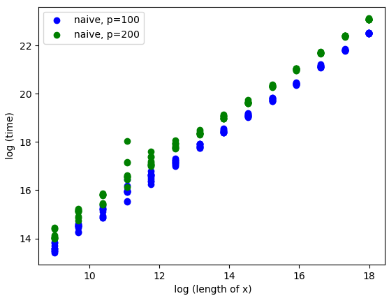
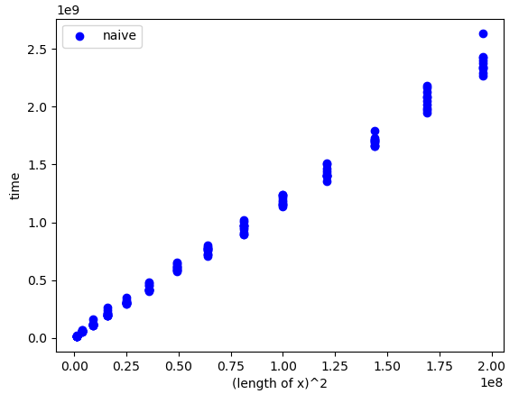
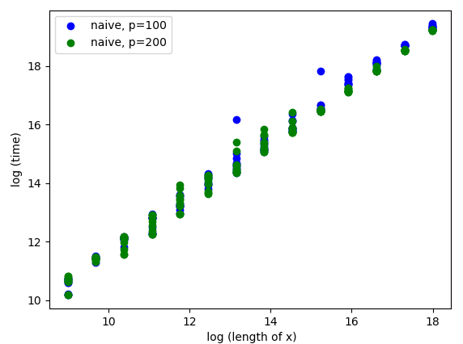
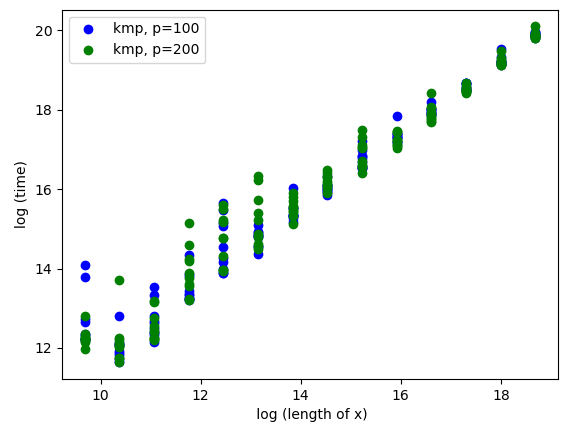
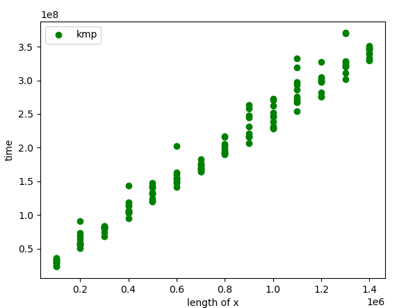

[](https://classroom.github.com/online_ide?assignment_repo_id=8370437&assignment_repo_type=AssignmentRepo)
# Basic exact pattern matching

This project is about exact pattern matching. You should implement the naive quadratic time algorithm and a linear time algorithm of your cheice, e.g. the border-array or the KMP-algorithm. The naive algorithm has the worst-case running time O(nm) and the other algorithms we have seen have worst-case running time O(n+m).

The algorithms should be implemented in two programs, `naive` and `lin`. Both programs should take two arguments (no more and no less): the first should be a Simple-FASTA file and the second a Simple-FASTQ file. The programs should output all matches in the Simple-SAM format to stdout (i.e., they should write to the terminal). Since we are only doing exact matching, the CIGAR strings in the output should consist of M’s only, since all the characters in the read will match the reference at the reported position.

For example, with this Simple-FASTA file

```
> chr1
mississippi
> chr2
mississippimississippi
```

and this Simple-FASTQ file

```
@read1
iss
@read2
mis
@read3
ssi
@read4
ssippi
```

your output should be

```
read1	chr1	2	3M	iss
read1	chr1	5	3M	iss
read1	chr2	2	3M	iss
read1	chr2	5	3M	iss
read1	chr2	13	3M	iss
read1	chr2	16	3M	iss
read2	chr1	1	3M	mis
read2	chr2	1	3M	mis
read2	chr2	12	3M	mis
read3	chr1	3	3M	ssi
read3	chr1	6	3M	ssi
read3	chr2	3	3M	ssi
read3	chr2	6	3M	ssi
read3	chr2	14	3M	ssi
read3	chr2	17	3M	ssi
read4	chr1	6	6M	ssippi
read4	chr2	6	6M	ssippi
read4	chr2	17	6M	ssippi
```

assuming you iterate over reads in an outer loop and FASTA records in an inner loop. If you order your loops differently, of course, the output will be different.

The project should be in groups of 2–3 students. It will not be graded.

## Part 1: parsers 

Write parsers for Simple-FASTA and Simple-FASTQ if you have not done so already.

## Part 2: simulating data for evaluation

For testing the running time as functions of n and m, you should also write code for generating Simple-FASTA and Simple-FASTQ files (with appropriate properties for your tests).

## Part 2: mappers

Now write the tools for exact pattern matching. You can use the naive algorithm to test your linear time algorithm; the result of the two programs that you write should be identical after you sort the output.

```sh
> ./naive fasta.fa fastq.fq | sort > naive.sam
> ./lin fasta.fa fastq.fq | sort > lin.sam
> diff naive.sam lin.sam
```

You might not have to sort the output, if you run through reads


## Evaluation

Implement the two algorithms in two tools, `naive` and `lin`, that must be present at the root of the repository once they are built.

The repository is set up to build the tools from the source code in `progs` if you run

```sh
> GOBIN=$PWD go install ./...
```


The test setup checks that they give the correct output on selected data, but you should still carefully test them.

Once you have implemented the tools, fill out the report below. 

## Report

### Insights you may have had while implementing and comparing the algorithms. 

During the testing we realized that the alphabets used when generating reads and genomes had a big impact on the performance of the naive algorithm. This boils to the fact that the algorithm quickly decides that the current placement of the read is not a match in the genome it is searching. This means that the naive algorithm behaves as a linear algorithm on these kinds of input. Thee naive algorithm therefore tends to outperform KMP since KMP needs to pay the overhead of creating the borderarray. After choosing an alphabet with less possible characters we made the naive algorithm actually increase quadratically as is also shown later in the report.

We also came to the conclusion that making weekly exercises was a good idea since a large part of the project was already done.


### Problems encountered if any. 
During implementation we found that the default buffersize of bufio.NewScanner is 2^16 bytes which caused problems during testing since when we wanted to test runningtime on genomes larger than 65536 characters the parser returned an empty string.

In the beginning we also faced some problems with the folder structure in regards to using our implementations of naive and lin in testing and thus we resorted to creating a stub of both in the algos_test.go file to then use when testing.


### Experiments that verifies the correctness of your implementations.

We verified the implementation of KMP by comparing the result to the result of the naive algorithm. We ran both algorithms on randomly generated data over different alphabets:  DNA, English alphabet, A, AB and (AA...AAB) and alphabets where occourences of some letters were way more common than others, etc. We also tried some edgecases such as empty x or p strings. In all cases the two algorithms generated reported the same matches. So we concluded that since both algorithms yielded some matches and the reads and genomes were sufficiently long and random, our implementation of KMP works.


### Experiments validating the running time.

For this section, you should address the following:

* An experiment that verifies that your implementation of `naive` uses no more time than O(nm) to find all occurrences of a given pattern in a text. Remember to explain your choice of test data. What are “best” and “worst” case inputs? 

To show the `naive` algorithm runs in O(nm) we conducted tests with a variable x value and different fixed p values.
These results can be seen in:



In this experiment we run the naive algorithm on a repetitive alphabet which is prone to containing a lot of matches before a mismatch occurs. This results in an expected worst case O(nm) performance.
It can clearly be seen that an increase in p value from 100 to 200 results in linear growth in the running time. This can be seen since the running time roughly doubles between the two runs of the algorithm.

We also tried to increment size of genome x and read p at the same time by some constant, in order to see if the algorithms running time would increase by n^2. This turned out to also be the case (notice that x axis is squared):



As mentioned earlier the best case for the `naive` is on random alphabets, where we only need to compare few symbols before mismatches occour. On such strings, we expect something similar to a linear running time. An example where we ran the naive alogrithm on a randomized string of 25 letters can be seen here:



* An experiment that verifies that your implementations of `lin` use no more time than O(n+m) to find all occurrences of a given pattern in a text. Remember to explain your choice of test data. What are “best” and “worst” case inputs?

In comparison the running time of the `lin` algorithm can be seen conducted in the same manner as we did for the naive algorithm with a repetitive alphabet. The results are seen on this image:



In the figure above it can be seen that p behaves similair to a constant as it disappears when m increases. This confirms the theoretical running time of O(n+m).

We also tried as we did for naive to increment size of genome x and read p at the same time by some constant and plot the outcome, expecting some linear growth due to the theoretical running time being O(m+n):
(notice the x axis here not squared as it was for naive)



